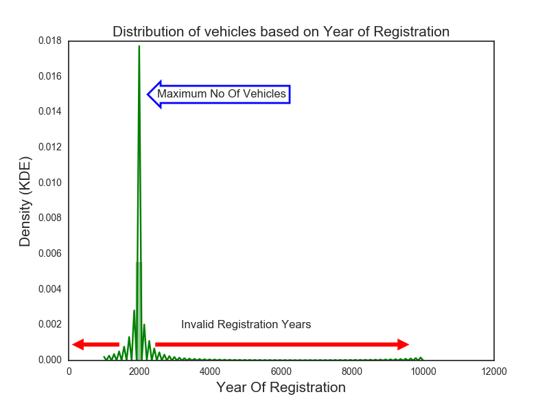
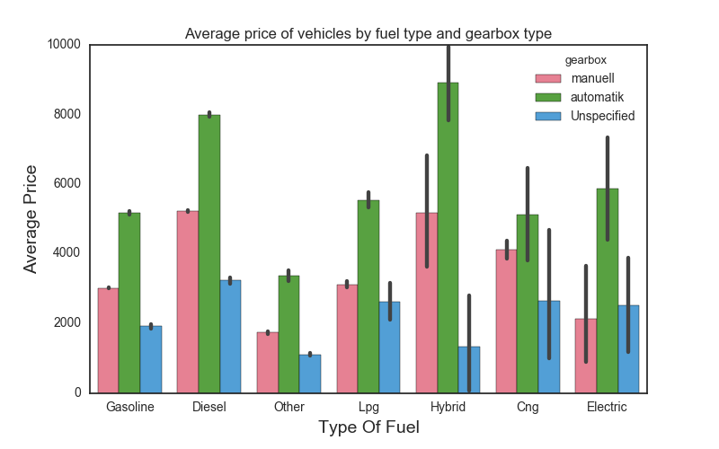
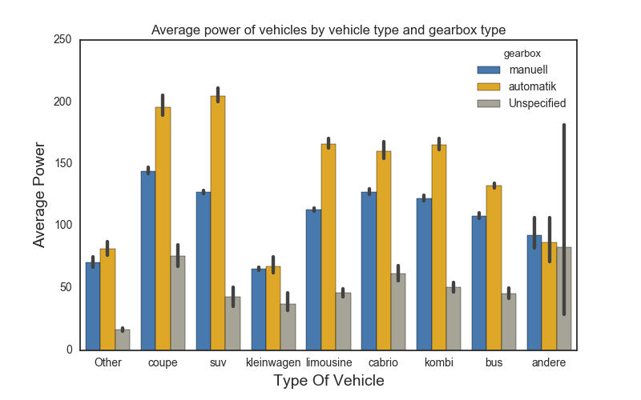
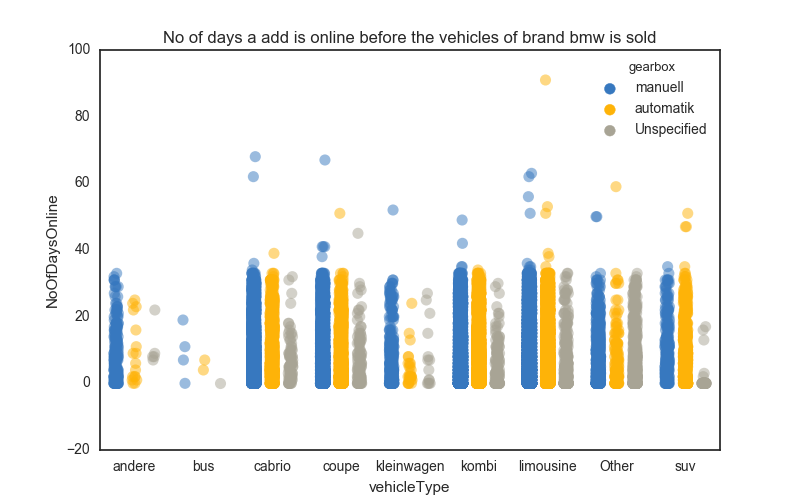

# Data analysis of used car database &nbsp;&nbsp;
Data Analysis, sometimes referred to as **exploratory data analysis (EDA)**, is a core component of data science. It is also the part on which data scientists, data engineers, and data analysts spend the majority of their time, making it extremely important in data science. This repository demonstrates some common exploratory data analysis methods and techniques using Python. For the purpose of illustration, the **[used car database](https://www.kaggle.com/orgesleka/used-cars-database)** dataset has been taken from Kaggle since it is one of the ideal datasets for performing **EDA** and taking a step towards the most amazing and interesting field of data science. Good luck with your _**EDA**_ on the _**used car database**_ dataset.
### DataSet Overview
  + The dataset is from **Kaggle** and contains details of the **used cars in Germany** on sale on **eBay**.
  + The dataset is not clean; hence, a lot of data cleaning is done. For example, prices were too high, which were replaced by the median, and outliers were removed accordingly. 
  + Also, vehicles whose registration year was **_greater than 2016_ and _less than 1890_** were removed from the dataset as this data is inconsistent and would yield incorrect results.
  + The dataset is cleaned and stored in a **CleanData** folder, which contains the entire cleaned dataset named **[cleaned_autos.csv](CleanData/CleanedDataSet)** and another folder named **[DataForAnalysis](CleanData/DataForAnalysis)** containing files structures containing subsets of the cleaned dataset based on the brand of the vehicles and vehicle types.  
  
### Sample Dataset
dateCrawled | name | seller | offerType | price | abtest | vehicleType | yearOfRegistration | gearbox | powerPS | model | kilometer | monthOfRegistration | fuelType | brand | notRepairedDamage | dateCreated | nrOfPictures | postalCode | lastSeen
--- | --- | --- | --- | --- | --- | --- | --- | --- |--- | --- | --- | --- | --- | --- | --- | --- | --- | --- | ---
2016-03-24 11:52:17 | Golf_3_1.6 | privat | Angebot | 480 | test | nan | 1993 | manuell | 0 | golf | 150000 | 0 | benzin | volkswagen | nan | 2016-03-24 00:00:00 | 0 | 70435 | 2016-04-07 03:16:57
2016-03-24 10:58:45 | A5_Sportback_2.7_Tdi | privat | Angebot | 18300 | test | coupe | 2011 | manuell | 190 | nan | 125000 | 5 | diesel | audi | ja | 2016-03-24 00:00:00 | 0 | 66954 | 2016-04-07 01:46:50
2016-03-14 12:52:21 | Jeep_Grand_Cherokee_"Overland" | privat | Angebot | 9800 | test | suv | 2004 | automatik | 163 | grand | 125000 | 8 | diesel | jeep | nan | 2016-03-14 00:00:00 | 0 | 90480 | 2016-04-05 12:47:46
***
### More Info
__*The main folder contains 9 folders*__.

  + Folders from Analysis1 - Analysis5 contain the **iPython Notebook**, **python scripts** along with the **Plots** for that analysis.
  + Folder for **[shell scripts](ShellScripts)**, which automates the creation of file structures and splitting of the data as mentioned above.
  + Datapreparation folder contains the **[Datapreparation iPython Script](DataPreparation/DataPreparation.py)** for cleaning of data.
  + The CleanData folder contains the clean dataset and subsets of data as per the **[file structure](CleanData/DataForAnalysis)**.
  + RawData folder which contains the **[raw dataset](RawData)**.   
 
***
### Analysis 1 &emsp;&emsp;&emsp;&emsp;&emsp;&emsp;&emsp;&emsp;&emsp;&emsp;&emsp;&emsp;&emsp;&emsp;&emsp;&emsp;&emsp;&emsp;&emsp;&emsp;&emsp;&emsp;[Analysis1.py](Analysis1/Analysis1.py)&emsp;[Analysis1.ipynb](Analysis1/Analysis1.ipynb)&emsp;[Plots](Analysis1/Plots)
+ This analysis gives the distribution of prices of vehicles based on vehicle types.
+ Output before cleaning the data is shown below to highlight the importance of cleaning this dataset.
+ **Histogram** and **KDE** before performing data cleaning.
+ It is visible that the dataset has **many outliers** and **inconsistent data** as the year of registration **cannot be more than 2016 and less than 1890**.

> Boxplot of vehicle prices based on the vehicle type after cleaning the dataset. The box plot depicts the price variation based on the vehicle type. Low, 25th, 50th(Median), 75th percentile, high can be estimated from this boxplot.

***
### Analysis 2 &emsp;&emsp;&emsp;&emsp;&emsp;&emsp;&emsp;&emsp;&emsp;&emsp;&emsp;&emsp;&emsp;&emsp;&emsp;&emsp;&emsp;&emsp;&emsp;&emsp;&emsp;[Analysis2.py](Analysis2/Analysis2.py)&emsp;[Analysis2.ipynb](Analysis2/Analysis2.ipynb)&emsp;[Plots](Analysis2/Plots)

+ This analysis gives the number of cars available for sale in the entire dataset based on a particular brand. 

> Barplot of the average price of the vehicles for sale based on the vehicle type and the car's gearbox.

***
### Analysis 3 &emsp;&emsp;&emsp;&emsp;&emsp;&emsp;&emsp;&emsp;&emsp;&emsp;&emsp;&emsp;&emsp;&emsp;&emsp;&emsp;&emsp;&emsp;&emsp;&emsp;&emsp;[Analysis3.py](Analysis3/Analysis3.py)&emsp;[Analysis3.ipynb](Analysis3/Analysis3.ipynb)&emsp;[Plots](Analysis3/Plots)

+ This analysis gives the average price for the vehicles based on the vehicle's fuel type and the vehicle's type.

> Barplot of the average power of the vehicle based on the fuel type of the vehicle and also on the type of the vehicle.

***
### Analysis 4 &emsp;&emsp;&emsp;&emsp;&emsp;&emsp;&emsp;&emsp;&emsp;&emsp;&emsp;&emsp;&emsp;&emsp;&emsp;&emsp;&emsp;&emsp;&emsp;&emsp;&emsp;[Analysis4.py](Analysis4/Analysis4.py)&emsp;[Analysis4.ipynb](Analysis4/Analysis4.ipynb)&emsp;[Plots](Analysis4/Plots)

+ This analysis gives you the average price of the brand of vehicles and their types, which are likely to be found in the dataset.

***
### Analysis 5 &emsp;&emsp;&emsp;&emsp;&emsp;&emsp;&emsp;&emsp;&emsp;&emsp;&emsp;&emsp;&emsp;&emsp;&emsp;&emsp;&emsp;&emsp;&emsp;&emsp;&emsp;[Analysis5.py](Analysis5/Analysis5.py)&emsp;[Analysis5.ipynb](Analysis5/Analysis5.ipynb)&emsp;[Plots](Analysis5/Plots)

+ This analysis gives you the distribution of the total no of days a particular vehicle has been online for sale before it was purchased. 
+ This is a **dynamic analysis** and can be applied to **any vehicle** by specifying the brand of choice as an argument to the Python script.
+ To run this file on your terminal type: __*Analysis5.py 'brand'*__  
+ where **'brand'** is the choice of brand vehicle you would like to see analysis about from the column **'brand'** in the dataset.

***
### Conclusion
__*Analysis 1*__

+ Many **outliers** with *registration year greater than 2016 and less than 1890* which are removed to make the dataset ready for analysis.
+ Vehicles with registration year **1990-2016** are available **maximum** for sale. Year **2000** being the **highest** with **24313** vehicles.

__*Analysis 2*__

+ Vehicles of type **SUV** and **Cabrio** are the **most expensive** with **greater than $5000** as compared to **Coupe**, **Bus** etc which are **moderately expensive** in the range of **$2650 to $5000** where as the **least expensive** being **Andere** and **Others** with price **less than $1800** on an *average*.
+ Vehicles of brands **Volkswagen**, **Opel** and **BMW** are the **maximum for sale** in the decreasing order with *Volkswagen being the maximum*.
+ As a general trend, vehicles that are **automatic** are the **most expensive** compared to manual and other unspecified gearbox types.

__*Analysis 3*__

+ **Average prices** of vehicles that are **Hybrid** are **most expensive** as compared to other fuel types like Diesel and Gasoline
+ **SUV** type of vehicles with gearbox type **automatic** has the **maximum power** and **Kleinwagen** with the **least**.

__*Analysis 4*__

+ Vehicles of brand **Audi** and type **SUV** are the **most expensive** of the avialable vehicles for sale.
+ Vehicles of brand **Porsche** and type **Kleinwagen** are the **least expensive** of the available vehicles for sale.

__*Analysis 5*__

+ Based on the selected brand of choice, it can be found out what **type of vehicles** in the **selected brand** tend to get **sold quickly online** compared to others.

***
